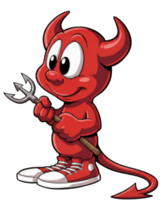
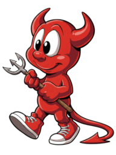
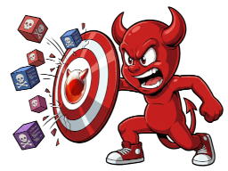
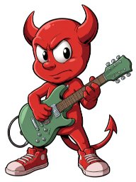
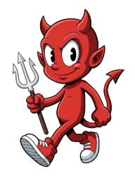
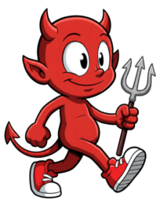

# FreeBSD Propaganda Images

I have generated several images to help promote FreeBSD. They are all released as Creative Commons CC0 (Public Domain) as they are produced via GenAI and I have no desire to claim any rights to them anyway. Any real work I have put into them was, well, curating the generated images and of course prepping them for the web, the latter of which was a bit of a chore. It would be nice if you would at least credit me for the work I did to prep them for the web if you do use them.  

Each image has been meticulously prepped to have proper alpha channels and be as well compressed as possible while maintaining a high level of quality. (Index color with alpha channel)  

When giving credit, please mention **[UNX.BZ](https://unx.bz)**, the Pubnix that motivated the creation of the images.

# Thumbnail Images 
| Classic Beastie | Classic Beastie Walking | Defending against a cyber attack |
|---|---|---|
|  |  |  |

NeoBeastie is a bit more Rock-n-Roll than the original but still has the same level of appeal.
| Beastie with a Guitar | Neo looking mischievous |  & friendly looking |
|---|---|---|
|  |  | 

The original classic Beastie Daemon mascot on the FreeBSD website is an iconic and recognizable symbol of the FreeBSD project. However... the available images themselves are quite low resolution. Now that GenAI is so powerful, I was able to use it to re-imagine the old Beastie Daemon design to a much higher resolution while keeping the same design and over all feeling. While I was at it, I created a re-imagined version of the Beastie Daemon I call NeoBeastie. He's a bit less dumpy looking but in my opinion still has the same appeal as the original. He also has... ears. (Not sure how you feel about ears but I'm certainly happy to have them.) There are high-res versions up to 8k resolution available in the dataset. There are SVG versions of some of them as well. To be honest, when they are availble they are going to be your best option. (I wasn't able to vectorize certain images which is why there may not even be an SVG version for every image.) They have been auto-vectorized to SVG and aren't actually any more efficient than the PNGs at smaller scales which is why I'm offering both options. (You decide which best fits your needs.) I'm still including the high-res raster versions just for the sake of completeness. (I mean, maybe you are a purist and don't want to use the auto-vectorized SVGs and would rather serve massive raster files. I'm leaving the choice up to you.) I'm hoping at least some of them will be added to the main FreeBSD website at some point as the technical quality really is in a completely different league compared to the old images.  

Enjoy!
